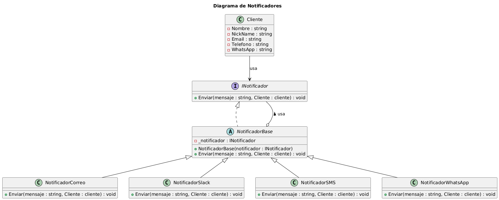
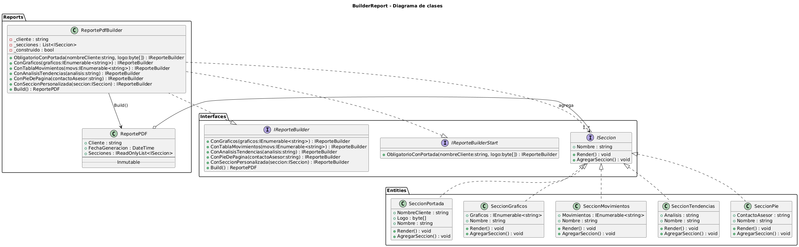
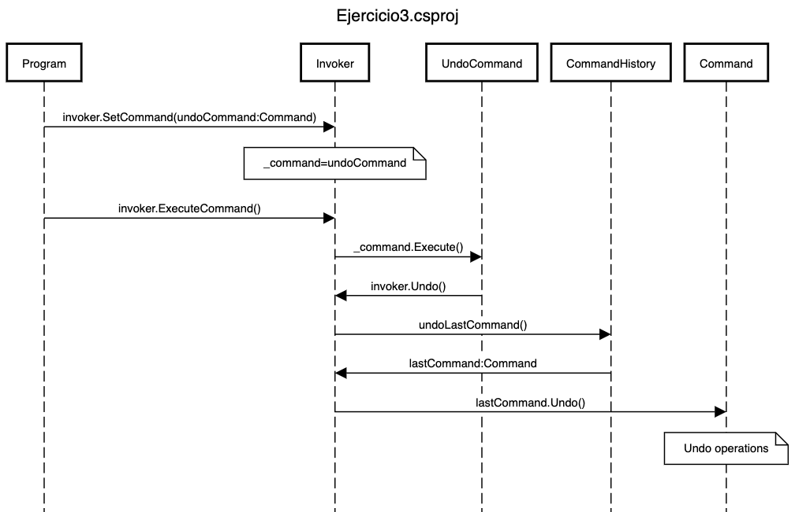
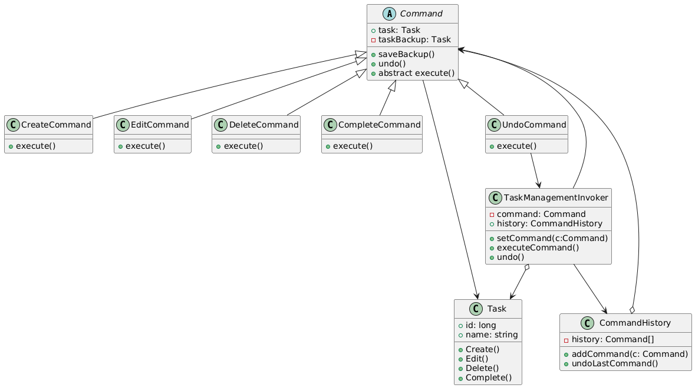
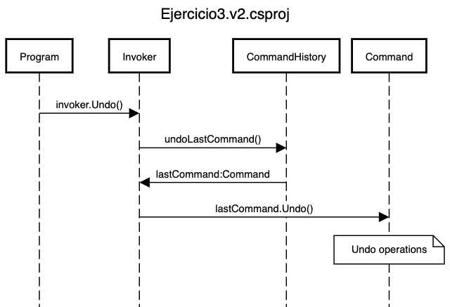
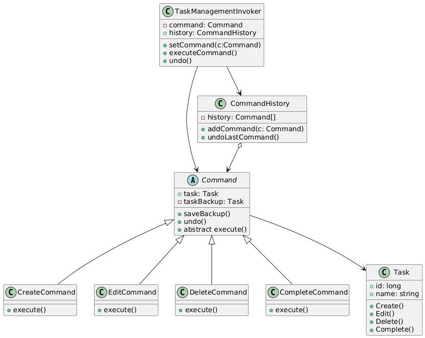

# TallerPatrones

## Ejercicio 1

A continuación se presenta el diagrama correspondiente al Ejercicio 1:

### Descripción del Diagrama

Para el ejercicio 1 tomamos la decisión de implementar el patrón **Decorator**, este patrón cumple con los requerimientos solicitados ya que:

- Mantiene una composición dinámica
- Solo crea una clase decorada
- Se evita la herencia combinada
- Agrega nuevas implementaciones sin tocar las existentes (OCP)

## Ejercicio 2

A continuación se presenta el diagrama correspondiente al Ejercicio 2:

### Descripción del Diagrama

Para el ejercicio 2 tomamos la decisión de implementar el patrón **Builder**, ya que el ejercicio cumplia con los sintomas clasicos que este patron resuelve,
realizando asi:

- separacion del proceso de construccion y el objeto final.
- creacion fluida.
- secciones opcionales sin sobrecarga de constructores.
- validacion centralizada y facil extencion.

## Ejercicio 3

### Descripción del Diagrama

Para el caso presentado en el ejercicio de gestión de tareas, se decidió aplicar el patrón **Command**, el cual permite el cumplimiento de los requisitos planteados.

Se realizaron dos implementaciones ligeramente diferentes, presentadas a continuación.
**Se complementa con diagramas de secuencia** para clarificar mejor la diferencia entre ambos diseños.

### Propuesta 1 (Ejercicio3.csproj)

Se basa en el ejemplo del libro Patrones de diseño de de Alexander Shvets en el que se crea un comando adicional para la operación de deshacer, la cual en su lógica, delega la ejecución nuevamente al Invocador (clase Application en el ejemplo).

A continuación se presenta el diagrama correspondiente al Ejercicio 3 Propuesta 1:

### Propuesta 2 (Ejercicio3.v2.csproj)

Se basa en el código de ejemplo Java disponible en https://refactoring.guru/es/design-patterns/command/java/example#example-0, en el cual el invocador directamente realiza la operación de deshacer sin la creación de un commando adicional.

A continuación se presenta el diagrama correspondiente al Ejercicio 3 Propuesta 2:

## Ejercicio 4

A continuación se presenta el diagrama correspondiente al Ejercicio 4:

### Descripción del Diagrama

Este diagrama ilustra la estructura del sistema de archivos que se implementa en el ejercicio aplicando el patrón **Composite**.

