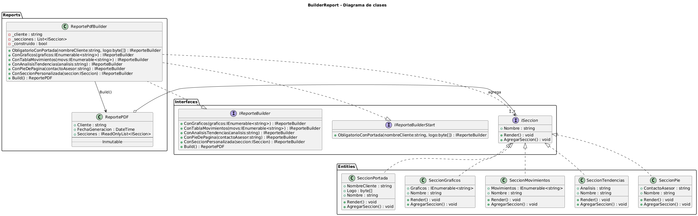
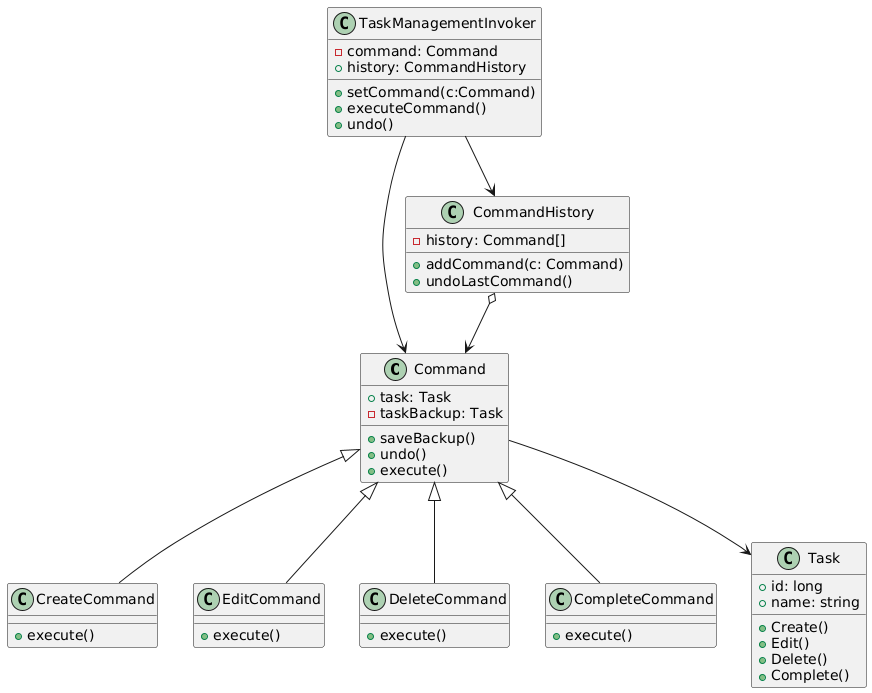

# TallerPatrones

## Ejercicio 1

A continuación se presenta el diagrama correspondiente al Ejercicio 1:

### Descripción del Diagrama

Para el ejercicio 1 tomamos la decisión de implementar el patrón **Decorator**, este patrón cumple con los requerimientos solicitados ya que:

- Mantiene una composición dinámica
- Solo crea una clase decorada
- Se evita la herencia combinada
- Agrega nuevas implementaciones sin tocar las existentes (OCP)

## Ejercicio 2

A continuación se presenta el diagrama correspondiente al Ejercicio 2:

### Descripción del Diagrama

Para el ejercicio 2 tomamos la decisión de implementar el patrón **Builder**, ya que el ejercicio cumplia con los sintomas clasicos que este patron resuelve,
realizando asi:

- separacion del proceso de construccion y el objeto final.
- creacion fluida.
- secciones opcionales sin sobrecarga de constructores.
- validacion centralizada y facil extencion.

## Ejercicio 3

A continuación se presenta el diagrama correspondiente al Ejercicio 3:

### Descripción del Diagrama

Para el caso presentado en el ejercicio, de gestión de tareas, se decidió aplicar el patrón **Command**, el cual permite el cumplimiento de los requisitos planteados.

## Ejercicio 4

A continuación se presenta el diagrama correspondiente al Ejercicio 4:

### Descripción del Diagrama

Este diagrama ilustra la estructura del sistema de archivos que se implementa en el ejercicio aplicando el patrón **Composite**.

