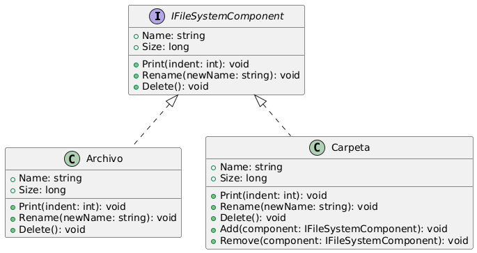

# TallerPatrones

## Ejercicio 

A continuación se presenta el diagrama correspondiente al Ejercicio 1:

### Descripción del Diagrama

Para el ejercicio 1 tomamos la decicion de implementar el patron decorator, este patron cumple con los requerimientos solicitados ya que:

- Mantiene una composicion dinamica
- Solo crea una clase decorada
- Se evita la herencia combinada
- Agrega nuevas implementaciones sin tocar las existentes (OCP)

## Ejercicio 4

A continuación se presenta el diagrama correspondiente al Ejercicio 4:

### Descripción del Diagrama

Este diagrama ilustra la estructura del sistema de archivos que se implementa en el ejercicio aplicando el patron Composite.

